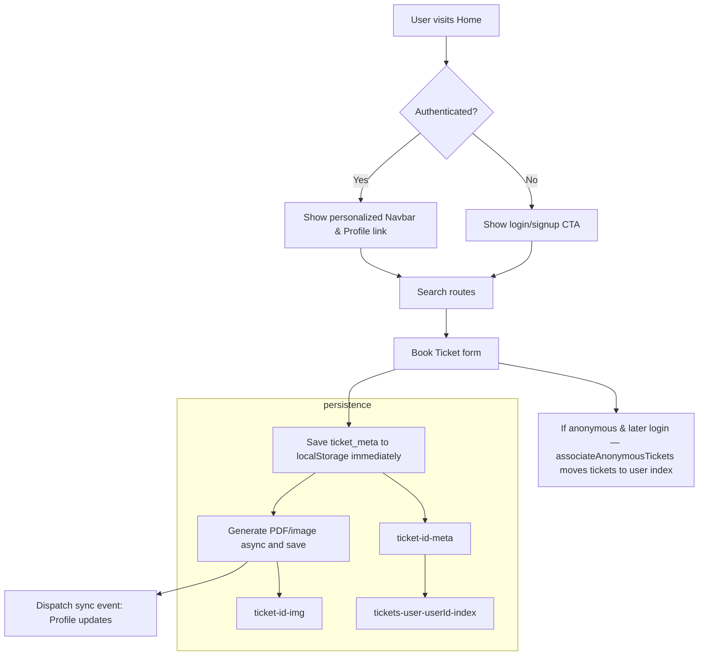
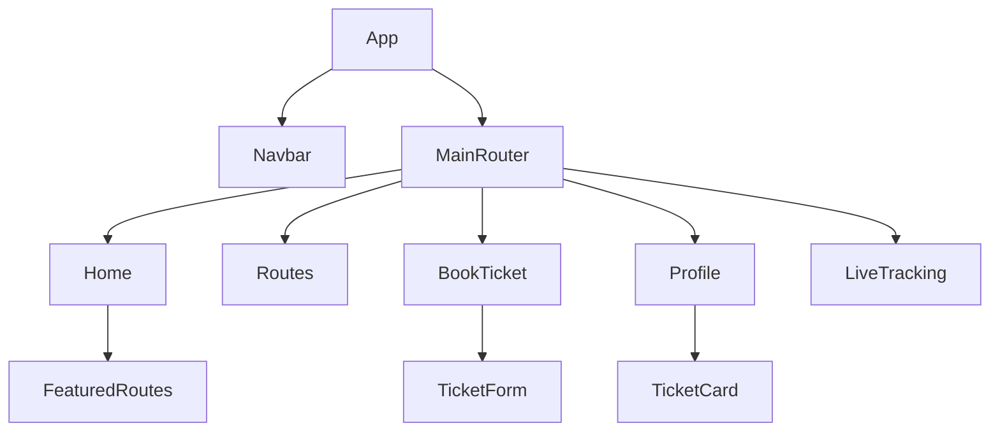

# 🚍 BharatBus — Frontend (React + TypeScript)

> A lightweight booking and tracking frontend for a bus service. This repository contains the frontend built with Vite, React + TypeScript, Tailwind-style utilities, and Framer Motion for animations.

---

## ⚡ Quick summary

- Built with: React + TypeScript, Vite, Framer Motion, Tailwind (utility-first CSS)
- Primary UI features: booking flow, live tracking, operator dashboard, profile with ticket persistence
- Local persistence: ticket artifacts and metadata are saved to localStorage for offline-friendly use

---

## 🧭 Project structure (important files)
```text
/frontend
  ├─ public/                    # Static assets served at '/'
  │   ├─ favicon.svg
  │   ├─ favicon-32.png
  │   └─ bus-stop.png (icons and fallbacks)
  ├─ src/
  │   ├─ components/           # Reusable UI pieces
  │   │   ├─ FlipCard.tsx
  │   │   ├─ Footer.tsx
  │   │   ├─ GlassCard.tsx
  │   │   ├─ GradientButton.tsx
  │   │   ├─ Navbar.tsx
  │   │   ├─ RouteMap.tsx
  │   │   └─ TicketCard.tsx
  │   ├─ context/              # React contexts (Auth, Theme)
  │   │   └─ AuthContext.tsx
  │   ├─ pages/                # Top-level route pages
  │   │   ├─ BookTicket.tsx
  │   │   ├─ Home.tsx
  │   │   ├─ LiveTracking.tsx
  │   │   ├─ LoginSignup.tsx
  │   │   ├─ MyTickets.tsx
  │   │   ├─ OperatorDashboard.tsx
  │   │   └─ Routes.tsx
  │   ├─ utils/
  │   │   └─ api.ts            # API helpers & localStorage utilities
  │   ├─ App.tsx
  │   ├─ index.css             # Global styles and glow utilities
  │   ├─ main.tsx              # React entry point
  │   └─ vite-env.d.ts
  ├─ index.html
  ├─ package.json
  ├─ vite.config.ts
  ├─ tsconfig.json
  ├─ tsconfig.app.json
  ├─ tsconfig.node.json
  ├─ postcss.config.js
  ├─ tailwind.config.js
  └─ eslint.config.js

README.md (this file)
```

---

## 🚦 Flow overview



---

## 🧩 Components & key UX details

- `Navbar` — responsive top nav with animated box-shaped indicator (Framer Motion). Shows gender-based logo (male/female/neutral) and small emoji badge over avatar. Supports dark & light mode visuals.
- `Home` — reduced-size search boxes on large screens, search button glows on hover, featured routes flip on hover.
- `BookTicket` — saves ticket metadata (`ticket_<id>_meta`) immediately to localStorage so Profile sees it instantly; heavy asset generation (PDF, image) runs in background.
- `Profile` — prefers `tickets_user_<userId>` index for lookup; listens for same-tab and cross-tab storage events to update the ticket list in real-time.
- `LiveTracking` — animated preview; simplified anonymous view.
- `OperatorDashboard` — (work-in-progress) planned glow effects for highlighted cards and buttons.

---

## 🧪 How to run (dev)

Open a terminal in the `frontend` folder and run:

```bash
# Install deps (if not already)
npm install

# Start dev server
npm run dev

# Typecheck
npm run typecheck

# Build
npm run build
```

---

## 🛠 Design decisions & conventions

- Local-only persistence for now: tickets and derived assets are kept in `localStorage` keys prefixed with `ticket_` for easy offline testing.
- `normalizeGender()` utility is used to map many string inputs into `male` / `female` / `other` to ensure consistent avatar rendering.
- Framer Motion `layoutId` is used for shared element transitions (Navbar indicator and a few card flip effects).
- UI styling uses a Tailwind-like utility approach with a small set of custom glow utilities in `src/index.css`.

---

## ✅ Current status & TODOs

- ✅ Immediate ticket metadata persistence (`ticket_<id>_meta`) and per-user index (`tickets_user_<userId>`)
- ✅ Profile listens to `storage` events and same-tab sync for instant updates
- ✅ Navbar: gender-based logo + animated box indicator
- ✅ Home: input size tweaks + glowing Search button
- ✅ Featured Routes: flip-on-hover and bus icon in place of inline "Book Now"
- ⏳ Operator dashboard glow effects (planned)
- ⏳ Final backend integration and secure ticket storage (planned)

---

## 📦 Storage schema (localStorage)

- `ticket_<id>` - full ticket JSON (if saved)
- `ticket_<id>_img` - image / preview (data URL)
- `ticket_<id>_meta` - minimal metadata saved immediately after booking
- `tickets_user_<userId>` - array of ticket ids owned by a user

---

## 🔁 Sync & auth behavior

- Same-tab: code dispatches a `tickets-updated` custom event to update components immediately.
- Cross-tab: `window.addEventListener('storage', ...)` used to detect changes and refresh ticket lists.
- On login/signup: `associateAnonymousTickets(userId)` transfers anonymous tickets to the user's index so their Profile shows them after authentication.

---

## 🧭 Diagrams (component tree)



---

## ⚙️ Notes for later (backend integration)

- When the backend is created:
  - Replace localStorage writes with authenticated API calls.
  - Keep the `ticket_<id>_meta` write locally as a cache until the server confirms persistence.
  - Use the server to validate and merge anonymous tickets after authentication.

---

## 🙋‍♂️ Contributing & contact

If you want me to continue, tell me which area to focus on next (dashboard glow, backend wiring, tests, performance), and I will proceed.

---

> This README intentionally omits a license section as requested.
