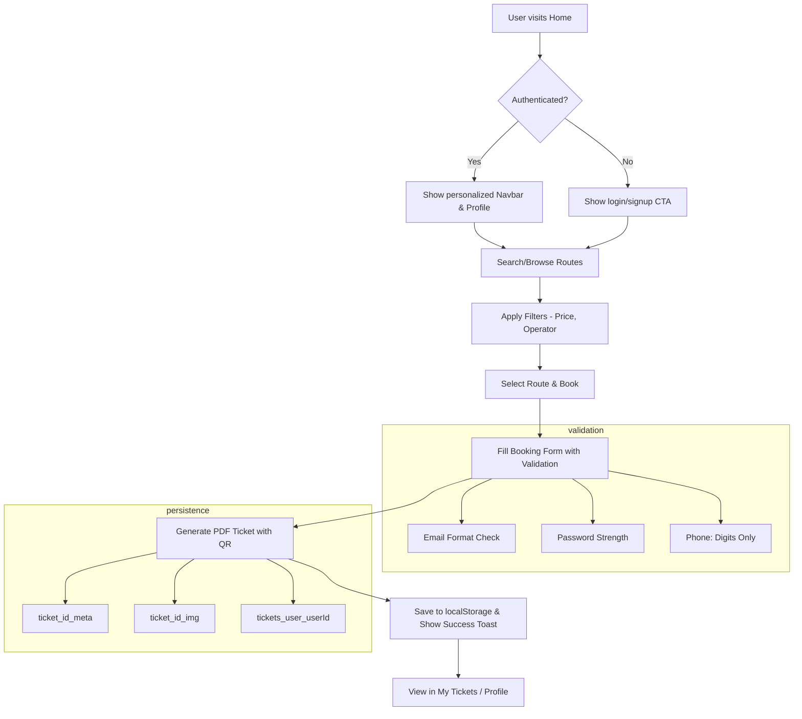
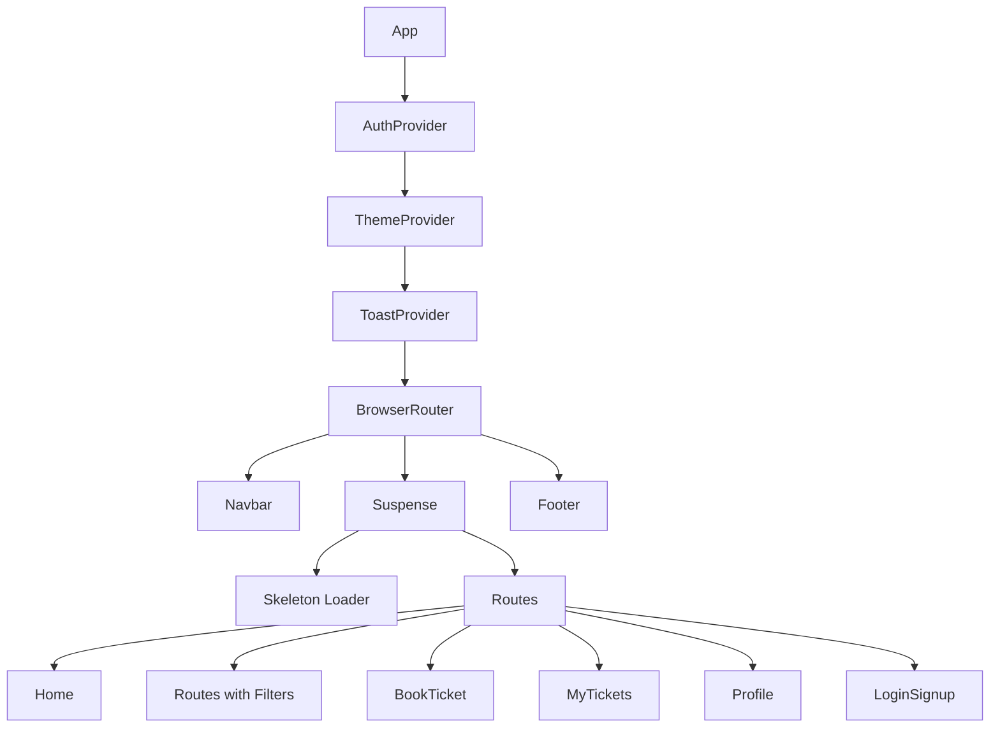

# 🚍 BharatBus — Frontend (React + TypeScript)

> A modern, feature-rich bus booking and tracking frontend for Indian bus services. Built with Vite, React + TypeScript, Tailwind CSS, and Framer Motion for smooth animations. Includes PDF ticket generation, toast notifications, form validation, and lazy-loaded pages for optimal performance.

---

## ⚡ Quick Summary

| Feature | Description |
|---------|-------------|
| **Framework** | React 18+ with TypeScript |
| **Build Tool** | Vite (fast HMR & optimized builds) |
| **Styling** | Tailwind CSS + custom glow/glass utilities |
| **Animations** | Framer Motion |
| **PDF Generation** | jsPDF with QR code embedding |
| **State** | React Context (Auth, Theme) |
| **Notifications** | Custom Toast system |
| **Form Validation** | Email regex, password strength indicator |
| **Code Splitting** | React.lazy() for all pages |

---

## 🆕 Recent Updates (v2.0)

### ✨ New Features
- **🔔 Toast Notification System** — Beautiful animated notifications for success, error, warning, and info messages
- **🔒 Password Strength Indicator** — Visual feedback with requirements checklist during signup
- **📧 Email Validation** — Real-time email format validation
- **📱 Phone Number Validation** — Strictly numeric input (digits only)
- **⚡ Lazy Loading** — All pages are code-split for faster initial load
- **💀 Skeleton Loaders** — Smooth loading states while pages load
- **🔍 Route Search & Filters** — Search by route code, operator, city + filter by price range and operator type
- **🎫 Featured Routes** — Highlighted popular routes (Bus 81, Express 42, Metro Link)

### 🛠 Improvements
- Form validation with inline error messages
- Loading spinner on form submission
- Better accessibility (ARIA labels)
- Cleaner error handling with toast feedback
- Responsive filter panel for routes

---

## 🧭 Project Structure
```text
/frontend
  ├─ public/                    # Static assets served at '/'
  │   ├─ favicon.svg
  │   ├─ favicon-32.png
  │   └─ bus-stop.png
  ├─ src/
  │   ├─ components/           # Reusable UI components
  │   │   ├─ FlipCard.tsx      # 3D flip card for routes
  │   │   ├─ Footer.tsx        # Site footer
  │   │   ├─ GlassCard.tsx     # Glassmorphism card wrapper
  │   │   ├─ GradientButton.tsx # Branded gradient button
  │   │   ├─ Navbar.tsx        # Responsive navigation
  │   │   ├─ PasswordStrength.tsx # 🆕 Password strength meter
  │   │   ├─ ProtectedRoute.tsx # Auth route guard
  │   │   ├─ RouteMap.tsx      # Route visualization
  │   │   ├─ Skeleton.tsx      # 🆕 Loading skeleton components
  │   │   ├─ TicketCard.tsx    # Ticket display card
  │   │   ├─ Toast.tsx         # 🆕 Toast notification system
  │   │   └─ Typewriter.tsx    # Typewriter text effect
  │   ├─ context/              # React contexts
  │   │   ├─ AuthContext.tsx   # Authentication state
  │   │   ├─ ThemeContext.tsx  # Dark/light theme
  │   │   └─ useAuth.ts        # Auth hook
  │   ├─ pages/                # Route pages (lazy-loaded)
  │   │   ├─ BookTicket.tsx    # Ticket booking form
  │   │   ├─ FAQs.tsx          # FAQ page
  │   │   ├─ HelpCenter.tsx    # Help & support
  │   │   ├─ Home.tsx          # Landing page
  │   │   ├─ LiveTracking.tsx  # Bus tracking
  │   │   ├─ LoginSignup.tsx   # Auth forms with validation
  │   │   ├─ MyTickets.tsx     # User's tickets
  │   │   ├─ OperatorDashboard.tsx # Operator panel
  │   │   ├─ PrivacyPolicy.tsx # Privacy page
  │   │   ├─ Profile.tsx       # User profile
  │   │   ├─ Routes.tsx        # Route listing with filters
  │   │   └─ TermsOfService.tsx # Terms page
  │   ├─ utils/
  │   │   ├─ api.ts            # API helpers
  │   │   ├─ download.ts       # File download utility
  │   │   └─ generateTicketPdf.ts # PDF ticket generator
  │   ├─ App.tsx               # Main app with providers
  │   ├─ index.css             # Global styles & utilities
  │   ├─ main.tsx              # React entry point
  │   └─ vite-env.d.ts
  ├─ index.html
  ├─ package.json
  ├─ vite.config.ts
  ├─ tsconfig.json
  ├─ tailwind.config.js
  └─ eslint.config.js
```

---

## 🚦 Application Flow



---

## 🧩 Key Components

### 🔔 Toast Notification System (`Toast.tsx`)
```tsx
import { useToast } from './components/Toast';

const toast = useToast();
toast.success('Booking confirmed!');
toast.error('Payment failed');
toast.warning('Session expiring soon');
toast.info('New routes available');
```

### 🔒 Password Strength (`PasswordStrength.tsx`)
Visual indicator showing:
- ✅ At least 8 characters
- ✅ Uppercase letter
- ✅ Lowercase letter
- ✅ Number
- ✅ Special character

### 💀 Skeleton Loaders (`Skeleton.tsx`)
Pre-built patterns:
- `<Skeleton variant="text" lines={3} />`
- `<TicketCardSkeleton />`
- `<RouteCardSkeleton />`
- `<ProfileSkeleton />`

### 🔍 Route Filters (`Routes.tsx`)
- **Search**: Fuzzy matching by bus number, operator, origin, destination
- **Price Range**: Slider filter ₹0 - ₹200
- **Operator Type**: WBTC, CSTC, NBSTC, Private

---

## 🧪 Getting Started

### Prerequisites
- Node.js 18+ 
- npm or yarn

### Installation & Development

```bash
# Navigate to frontend directory
cd frontend

# Install dependencies
npm install

# Start development server
npm run dev

# Type checking
npm run typecheck

# Production build
npm run build

# Preview production build
npm run preview
```

### Environment Variables
Create a `.env` file in the frontend directory:
```env
VITE_API_URL=http://localhost:3000/api
```

---

## 🎨 UI/UX Features

| Feature | Description |
|---------|-------------|
| **Glassmorphism** | Frosted glass cards with backdrop blur |
| **Gradient Buttons** | Orange-to-yellow branded gradients |
| **Flip Cards** | 3D flip animation for route details |
| **Glow Effects** | Neon glow on hover states |
| **Dark/Light Mode** | System-aware + manual toggle |
| **Responsive Design** | Mobile-first, works on all screen sizes |
| **Smooth Animations** | Page transitions & micro-interactions |

---

## 🛠 Architecture & Design Decisions

### Performance Optimizations
- **Lazy Loading**: All page components use `React.lazy()` with `Suspense`
- **Code Splitting**: Each route is a separate chunk
- **Skeleton Loading**: Perceived performance boost with loading states
- **Optimized Re-renders**: Proper use of `useCallback` and `useMemo`

### Form Validation Strategy
- Real-time validation on input change
- Email: Regex pattern matching
- Password: Strength meter with 5 requirements
- Phone: Strictly numeric (non-digits stripped automatically)
- Inline error messages with icons

### State Management
- **AuthContext**: User authentication state, login/logout/signup
- **ThemeContext**: Dark/light mode preference
- **Local State**: Form data, UI state managed with `useState`

### Styling Conventions
- Tailwind utility classes for rapid development
- Custom CSS in `index.css` for glow/glass effects
- CSS variables for theming
- `light:` prefix for light mode overrides

---

## ✅ Feature Status

### Completed ✅
- [x] Toast notification system with 4 variants
- [x] Password strength indicator with checklist
- [x] Email validation with regex
- [x] Phone number: digits-only enforcement
- [x] Lazy loading for all pages
- [x] Skeleton loading components
- [x] Route search with fuzzy matching
- [x] Route filters (price range, operator type)
- [x] Featured routes section
- [x] PDF ticket generation with QR codes
- [x] Ticket persistence in localStorage
- [x] Dark/light theme support
- [x] Responsive navigation
- [x] Gender-based avatar display

### Planned 🚧
- [ ] Backend API integration
- [ ] Real payment gateway
- [ ] Live GPS tracking
- [ ] Push notifications
- [ ] Multi-language support (i18n)
- [ ] Seat selection UI
- [ ] Ticket cancellation/refund
- [ ] User reviews & ratings
- [ ] PWA offline support

---

## 📦 LocalStorage Schema

| Key Pattern | Description |
|-------------|-------------|
| `ticket_<id>` | PDF data URI for the ticket |
| `ticket_<id>_img` | QR code image data URL |
| `ticket_<id>_meta` | Ticket metadata (JSON) |
| `tickets_user_<userId>` | Array of ticket IDs owned by user |
| `auth_user` | Current authenticated user object |

### Ticket Meta Structure
```json
{
  "id": "BBS123ABC",
  "from": "Kolkata",
  "to": "Siliguri",
  "date": "2025-12-01",
  "name": "John Doe",
  "passengers": 2,
  "phone": "9876543210",
  "userId": "user_abc123"
}
```

---

## 🔁 Cross-Tab Sync & Events

### Custom Events
- `tickets-updated`: Dispatched when a ticket is created/modified
- `storage`: Native event for cross-tab localStorage sync

### Auth Flow
1. User logs in → `auth_user` saved to localStorage
2. Existing anonymous tickets can be associated with user
3. On signup, old ticket keys are cleared to prevent phantom tickets
4. Profile and MyTickets listen for storage events to refresh

---

## 🧭 Component Hierarchy



---

## ⚙️ Backend Integration Notes

When connecting to a backend:

1. **API Endpoints** (suggested):
   ```
   POST /api/auth/login
   POST /api/auth/signup
   GET  /api/routes
   POST /api/bookings
   GET  /api/bookings/:userId
   ```

2. **Replace localStorage** with API calls but keep local cache for offline support

3. **Add JWT tokens** for authenticated requests

4. **Implement proper error handling** with toast notifications

---

## 🔐 Security Considerations

- Passwords are not stored locally (only auth tokens should be)
- Form inputs are sanitized (phone strips non-digits)
- Email validation prevents malformed submissions
- Protected routes redirect unauthenticated users

---

## 📱 Browser Support

- ✅ Chrome 90+
- ✅ Firefox 88+
- ✅ Safari 14+
- ✅ Edge 90+
- ✅ Mobile browsers (iOS Safari, Chrome Android)

---

## 🤝 Contributing

1. Fork the repository
2. Create a feature branch: `git checkout -b feature/amazing-feature`
3. Commit changes: `git commit -m 'Add amazing feature'`
4. Push to branch: `git push origin feature/amazing-feature`
5. Open a Pull Request

---

## 📄 License

This project is for educational/demo purposes. Feel free to use and modify.

---

## 👨‍💻 Author

**KGFCH2** — BharatBus Project

---

> Built with ❤️ using React, TypeScript, and Tailwind CSS

